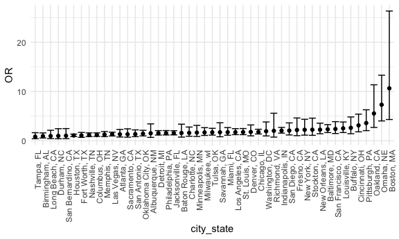
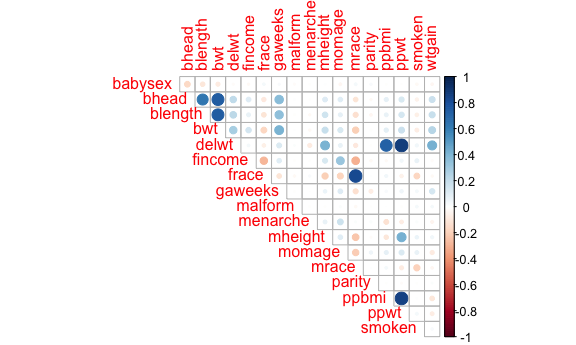
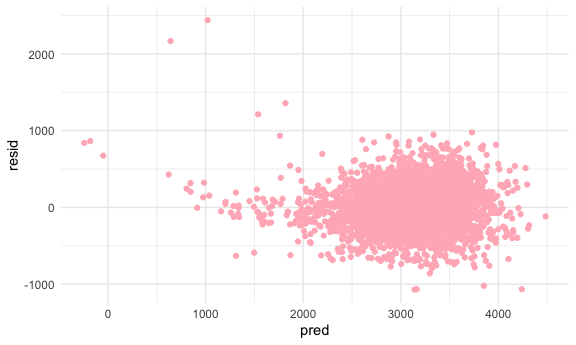

Homework 6
================
Phoebe Mo
2020-12-4

## Problem 1

Read in the data

``` r
homicide_df =
  read_csv("Data/homicide-data.csv", na = c("", "NA", "Unknown")) %>%
  mutate(
    city_state = str_c(city, state, sep = ", "),
    victim_age = as.numeric(victim_age),
    resolution = case_when(
      disposition == "Closed without arrest" ~ 0,
      disposition == "Open/No arrest" ~ 0,
      disposition == "Closed by arrest" ~ 1
    )
  ) %>%
  filter(
    victim_race %in% c("White", "Black"),
    city_state != "Tulsa, AL") %>%
    dplyr::select(city_state, resolution, victim_age, victim_race, victim_sex)
```

    ## Parsed with column specification:
    ## cols(
    ##   uid = col_character(),
    ##   reported_date = col_double(),
    ##   victim_last = col_character(),
    ##   victim_first = col_character(),
    ##   victim_race = col_character(),
    ##   victim_age = col_double(),
    ##   victim_sex = col_character(),
    ##   city = col_character(),
    ##   state = col_character(),
    ##   lat = col_double(),
    ##   lon = col_double(),
    ##   disposition = col_character()
    ## )

Start with only one city.

``` r
baltimore_df =
  homicide_df %>%
  filter(city_state == "Baltimore, MD")

glm(resolution ~ victim_age + victim_race + victim_sex,
    data = baltimore_df,
    family = binomial()) %>%
  broom::tidy() %>%
  mutate(
    OR = exp(estimate),
    CI_lower = exp(estimate - 1.96 * std.error),
    CI_upper = exp(estimate + 1.96 * std.error)
  ) %>%
  dplyr::select(term, OR, starts_with("CI")) %>%
  knitr::kable(digits = 3)
```

| term              |    OR | CI\_lower | CI\_upper |
| :---------------- | ----: | --------: | --------: |
| (Intercept)       | 1.363 |     0.975 |     1.907 |
| victim\_age       | 0.993 |     0.987 |     1.000 |
| victim\_raceWhite | 2.320 |     1.648 |     3.268 |
| victim\_sexMale   | 0.426 |     0.325 |     0.558 |

Try this across cities.

``` r
models_results_df =
  homicide_df %>%
  nest(data = -city_state) %>%
  mutate(
    models = 
      map(.x = data, ~glm(resolution ~ victim_age + victim_race + victim_sex, data = .x, family = binomial())),
      results = map(models, broom::tidy)
  ) %>%
  dplyr::select(city_state, results) %>%
  unnest(results) %>%
  mutate(
    OR = exp(estimate),
    CI_lower = exp(estimate - 1.96 * std.error),
    CI_upper = exp(estimate + 1.96 * std.error)
  ) %>%
  dplyr::select(city_state, term, OR, starts_with("CI"))
```

``` r
models_results_df %>%
  filter(term == "victim_raceWhite") %>%
  mutate(city_state = fct_reorder(city_state, OR)) %>%
  ggplot(aes(x = city_state, y = OR)) +
  geom_point() +
  geom_errorbar(aes(ymin = CI_lower, ymax = CI_upper)) +
  theme(axis.text.x = element_text(angle = 90, hjust = 1))
```


In the plot, the OR is mostly greater than 1, meaning it is less likely
that homicide happens in the Black race than the White race.

## Problem 2

read in data and manipulation

``` r
bw_df =
  read_csv("Data/birthweight.csv")
```

    ## Parsed with column specification:
    ## cols(
    ##   .default = col_double()
    ## )

    ## See spec(...) for full column specifications.

stepwise regression to find find suitable predictors

``` r
# checking collinearity
par(mar = c(4,5,1,1))
cor(bw_df %>% dplyr::select(-c(pnumlbw, pnumsga))) %>%
  corrplot(method = "circle", type = "upper", diag = FALSE)
```



``` r
# delwt and ppwt have high correlation; mrace and frace have high correlation; ppbmi and ppwt have high correlation; so we preserve one of them in each high correlation pair; pnumlbw and pnumsga are dropped becasue all entries for them are 0

# backward regression
stepOne = lm(bwt ~ babysex + bhead + blength + delwt + fincome + gaweeks + malform + menarche + mheight + momage + mrace + parity + ppbmi + smoken + wtgain, data = bw_df) %>% broom::tidy()

# exclude ppbmi which p-value = 0.945
stepTwo = lm(bwt ~ babysex + bhead + blength + delwt + fincome + gaweeks + malform + menarche + mheight + momage + mrace + parity + smoken + wtgain, data = bw_df) %>% broom::tidy()

# exclude malform which p-value = 0.837
stepThree = lm(bwt ~ babysex + bhead + blength + delwt + fincome + gaweeks + menarche + mheight + momage + mrace + parity + smoken + wtgain, data = bw_df) %>% broom::tidy()

# exclude menarche which p-value = 0.14
stepFinal = lm(bwt ~ babysex + bhead + blength + delwt + fincome + gaweeks + mheight + momage + mrace + parity + smoken + wtgain, data = bw_df)
```

After solving for collinearity and using backward regression to select
reasonable predictors for my model, I include 12 variables as
predictors.

delwt and ppwt have high correlation; mrace and frace have high
correlation; ppbmi and ppwt have high correlation; so we preserve one of
them in each high correlation pair; pnumlbw and pnumsga are dropped
becasue all entries for them are 0.

In the backward regression, ppbmi, malform, and menarche are dropped in
order.

Here is a plot showing residuals against fitted values for my model

``` r
# make a plot of model residuals against fitted values
bw_df %>%
  add_predictions(stepFinal) %>%
  add_residuals(stepFinal) %>%
  ggplot(aes(x = pred, y = resid)) +
  geom_point(color = 'lightpink')
```



We can see from the plot: the residuals are bouncing around 0 and
indicates a quite equal variance.
