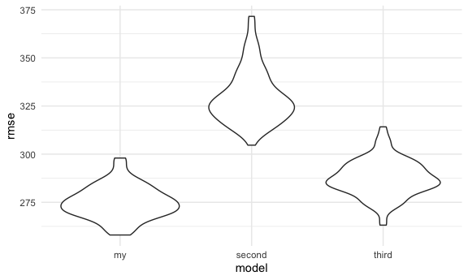
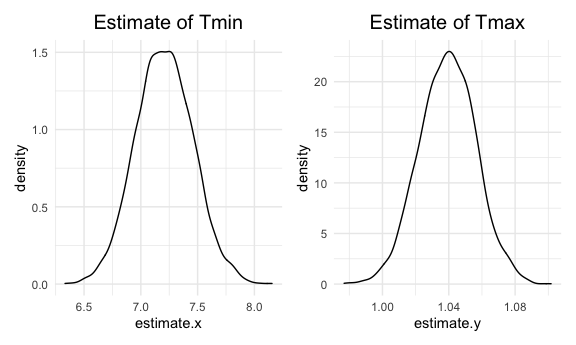

Homework 6
================
Phoebe Mo
2020-12-4

## Problem 1

Read in the data

``` r
homicide_df =
  read_csv("Data/homicide-data.csv", na = c("", "NA", "Unknown")) %>%
  mutate(
    city_state = str_c(city, state, sep = ", "),
    victim_age = as.numeric(victim_age),
    resolution = case_when(
      disposition == "Closed without arrest" ~ 0,
      disposition == "Open/No arrest" ~ 0,
      disposition == "Closed by arrest" ~ 1
    )
  ) %>%
  filter(
    victim_race %in% c("White", "Black"),
    city_state != "Tulsa, AL") %>%
    dplyr::select(city_state, resolution, victim_age, victim_race, victim_sex)
```

    ## Parsed with column specification:
    ## cols(
    ##   uid = col_character(),
    ##   reported_date = col_double(),
    ##   victim_last = col_character(),
    ##   victim_first = col_character(),
    ##   victim_race = col_character(),
    ##   victim_age = col_double(),
    ##   victim_sex = col_character(),
    ##   city = col_character(),
    ##   state = col_character(),
    ##   lat = col_double(),
    ##   lon = col_double(),
    ##   disposition = col_character()
    ## )

Start with only one city.

``` r
baltimore_df =
  homicide_df %>%
  filter(city_state == "Baltimore, MD")

glm(resolution ~ victim_age + victim_race + victim_sex,
    data = baltimore_df,
    family = binomial()) %>%
  broom::tidy() %>%
  mutate(
    OR = exp(estimate),
    CI_lower = exp(estimate - 1.96 * std.error),
    CI_upper = exp(estimate + 1.96 * std.error)
  ) %>%
  dplyr::select(term, OR, starts_with("CI")) %>%
  knitr::kable(digits = 3)
```

| term              |    OR | CI\_lower | CI\_upper |
| :---------------- | ----: | --------: | --------: |
| (Intercept)       | 1.363 |     0.975 |     1.907 |
| victim\_age       | 0.993 |     0.987 |     1.000 |
| victim\_raceWhite | 2.320 |     1.648 |     3.268 |
| victim\_sexMale   | 0.426 |     0.325 |     0.558 |

Try this across cities.

``` r
models_results_df =
  homicide_df %>%
  nest(data = -city_state) %>%
  mutate(
    models = 
      map(.x = data, ~glm(resolution ~ victim_age + victim_race + victim_sex, data = .x, family = binomial())),
      results = map(models, broom::tidy)
  ) %>%
  dplyr::select(city_state, results) %>%
  unnest(results) %>%
  mutate(
    OR = exp(estimate),
    CI_lower = exp(estimate - 1.96 * std.error),
    CI_upper = exp(estimate + 1.96 * std.error)
  ) %>%
  dplyr::select(city_state, term, OR, starts_with("CI"))
```

``` r
models_results_df %>%
  filter(term == "victim_raceWhite") %>%
  mutate(city_state = fct_reorder(city_state, OR)) %>%
  ggplot(aes(x = city_state, y = OR)) +
  geom_point() +
  geom_errorbar(aes(ymin = CI_lower, ymax = CI_upper)) +
  theme(axis.text.x = element_text(angle = 90, hjust = 1))
```


In the plot, the OR is mostly greater than 1, meaning it is less likely
that homicide happens in the Black race than the White race.

## Problem 2

read in data and manipulation

``` r
bw_df =
  read_csv("Data/birthweight.csv")
```

    ## Parsed with column specification:
    ## cols(
    ##   .default = col_double()
    ## )

    ## See spec(...) for full column specifications.

stepwise regression to find find suitable predictors

``` r
# checking collinearity
par(mar = c(4,5,1,1))
cor(bw_df %>% dplyr::select(-c(pnumlbw, pnumsga))) %>%
  corrplot(method = "circle", type = "upper", diag = FALSE)
```


``` r
# delwt and ppwt have high correlation; mrace and frace have high correlation; ppbmi and ppwt have high correlation; so we preserve one of them in each high correlation pair; pnumlbw and pnumsga are dropped becasue all entries for them are 0

# backward regression
stepOne = lm(bwt ~ babysex + bhead + blength + delwt + fincome + gaweeks + malform + menarche + mheight + momage + mrace + parity + ppbmi + smoken + wtgain, data = bw_df) %>% broom::tidy()

# exclude ppbmi which p-value = 0.945
stepTwo = lm(bwt ~ babysex + bhead + blength + delwt + fincome + gaweeks + malform + menarche + mheight + momage + mrace + parity + smoken + wtgain, data = bw_df) %>% broom::tidy()

# exclude malform which p-value = 0.837
stepThree = lm(bwt ~ babysex + bhead + blength + delwt + fincome + gaweeks + menarche + mheight + momage + mrace + parity + smoken + wtgain, data = bw_df) %>% broom::tidy()

# exclude menarche which p-value = 0.14
stepFinal = lm(bwt ~ babysex + bhead + blength + delwt + fincome + gaweeks + mheight + momage + mrace + parity + smoken + wtgain, data = bw_df)
```

After solving for collinearity and using backward regression to select
reasonable predictors for my model, I include 12 variables as
predictors.

delwt and ppwt have high correlation; mrace and frace have high
correlation; ppbmi and ppwt have high correlation; so we preserve one of
them in each high correlation pair; pnumlbw and pnumsga are dropped
becasue all entries for them are 0.

In the backward regression, ppbmi, malform, and menarche are dropped in
order.

Here is a plot showing residuals against fitted values for my model

``` r
# make a plot of model residuals against fitted values
bw_df %>%
  add_predictions(stepFinal) %>%
  add_residuals(stepFinal) %>%
  ggplot(aes(x = pred, y = resid)) +
  geom_point(color = 'lightpink')
```


We can see from the plot: the residuals are bouncing around 0 and
indicates a quite equal variance.

Next, compare my model to the two given models through CV

``` r
model_two = lm(bwt ~ blength + gaweeks, data = bw_df)
model_three = lm(bwt ~ bhead * blength * babysex, data = bw_df)

cv_df = crossv_mc(bw_df, 100) %>%
  mutate(
    train = map(train, as_tibble),
    test = map(test, as_tibble)
  ) %>%
  mutate(
    my_mod = map(train, ~lm(bwt ~ babysex + bhead + blength + delwt + fincome + gaweeks + mheight + momage + mrace + parity + smoken + wtgain, data = .x)),
    second_mod = map(train, ~lm(bwt ~ blength + gaweeks, data = .x)),
    third_mod = map(train, ~lm(bwt ~ bhead * blength * babysex, data = .x))
  ) %>%
  mutate(
    rmse_my = map2_dbl(my_mod, test, ~rmse(model = .x, data = .y)),
    rmse_second = map2_dbl(second_mod, test, ~rmse(model = .x, data = .y)),
    rmse_third = map2_dbl(third_mod, test, ~rmse(model = .x, data = .y))
  )
```

    ## Warning: Problem with `mutate()` input `rmse_my`.
    ## ℹ prediction from a rank-deficient fit may be misleading
    ## ℹ Input `rmse_my` is `map2_dbl(my_mod, test, ~rmse(model = .x, data = .y))`.

    ## Warning in predict.lm(model, data): prediction from a rank-deficient fit may be
    ## misleading

    ## Warning: Problem with `mutate()` input `rmse_my`.
    ## ℹ prediction from a rank-deficient fit may be misleading
    ## ℹ Input `rmse_my` is `map2_dbl(my_mod, test, ~rmse(model = .x, data = .y))`.

    ## Warning in predict.lm(model, data): prediction from a rank-deficient fit may be
    ## misleading

``` r
cv_df %>%
  dplyr::select(starts_with("rmse")) %>%
  pivot_longer(
    everything(),
    names_to = "model",
    values_to = "rmse",
    names_prefix = "rmse_"
  ) %>%
  mutate(model = fct_inorder(model)) %>%
  ggplot(aes(x = model, y = rmse)) + geom_violin()
```



As can see from the plot showing the cross-validated prediction
errors(rmse) for each model, my diy model performs the best and has the
lease median of rmse.

## Problem 3

proportion of the outcome variation explained by the predictor(adjusted
R2)

read in 2017 Central Park weather data

``` r
weather_df = 
  rnoaa::meteo_pull_monitors(
    c("USW00094728"),
    var = c("PRCP", "TMIN", "TMAX"), 
    date_min = "2017-01-01",
    date_max = "2017-12-31") %>%
  mutate(
    name = recode(id, USW00094728 = "CentralPark_NY"),
    tmin = tmin / 10,
    tmax = tmax / 10) %>%
  dplyr::select(name, id, everything())
```

    ## Registered S3 method overwritten by 'hoardr':
    ##   method           from
    ##   print.cache_info httr

    ## using cached file: /Users/phoebee/Library/Caches/R/noaa_ghcnd/USW00094728.dly

    ## date created (size, mb): 2020-12-06 18:10:00 (7.536)

    ## file min/max dates: 1869-01-01 / 2020-12-31

Do bootstrapping and plot the distribution of two estimates

``` r
boot_straps =
  weather_df %>%
  modelr::bootstrap(n = 5000) %>%
  mutate(
    models = map(strap, ~lm(tmax ~ tmin, data = .x)),
    results = map(models, broom::tidy),
    glance = map(models, broom::glance)
  ) %>%
  dplyr::select(-strap, -models) %>%
  unnest(results) %>%
  dplyr::select(-statistic, -p.value) %>%
  unnest(glance) %>%
  dplyr::select(.id, term, estimate, adj.r.squared)

boot_intercept =
  boot_straps %>%
  filter(term == "(Intercept)")

boot_tmin =
  boot_straps %>%
  filter(term == "tmin")

join_df =
  left_join(boot_intercept, boot_tmin, by = ".id") %>%
  mutate(adj_r_squared = adj.r.squared.x) %>%
  dplyr::select(-adj.r.squared.y, -adj.r.squared.x, -term.x, -term.y) %>%
  mutate(log_multiply = log(estimate.x * estimate.y))
```

Here is the plot of tmax estimate and tmin estimate

``` r
tmax_est =
  join_df %>%
  ggplot(aes(x = estimate.x)) +
  geom_density() +
  labs(title = "Estimate of Tmin") +
  theme(plot.title = element_text(size = 15, hjust = 0.5))
tmin_est = 
  join_df %>%
  ggplot(aes(x = estimate.y)) +
  geom_density() +
  labs(title = "Estimate of Tmax") +
  theme(plot.title = element_text(size = 15, hjust = 0.5))
tmax_est + tmin_est
```



The distribution of estimate of tmin has a little bit heavy tail to the
high values and the distribution of estimate of tmax has a little bit
heavy tail to the low values

Next, identify the 2.5% and 97.5% quantiles to provide a 95% confidence
interval for r2 and log(b1\*b2)

``` r
join_df %>%
  dplyr::select(adj_r_squared, log_multiply) %>%
  pivot_longer(
    1:2,
    names_to = "type",
    values_to = "value"
  ) %>%
  group_by(type) %>%
  summarize(
    CI_lower = quantile(value, 0.025),
    CI_upper = quantile(value, 0.975)
  ) %>%
  knitr::kable()
```

    ## `summarise()` ungrouping output (override with `.groups` argument)

| type            | CI\_lower | CI\_upper |
| :-------------- | --------: | --------: |
| adj\_r\_squared |     0.893 |     0.927 |
| log\_multiply   |     1.966 |     2.059 |
